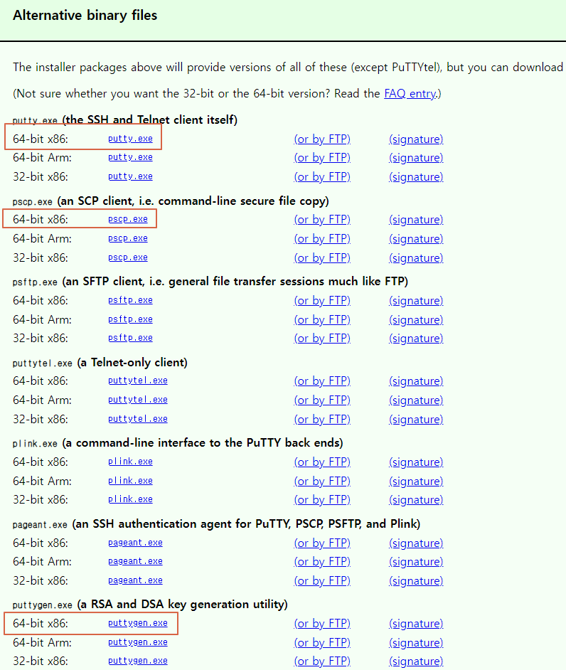

# EC2 인스턴스 생성 후 가상 서버에 접속하기

### EC2란 AWS에서 제공하는 클라우드 컴퓨팅 서비스이며   가상 서버를 구축해 클라이언트에게 웹 서비스를 제공할 수 있다.

# AWS에서 EC2 인스턴스 생성

### 1. 먼저 AWS 콘솔에 로그인한 후 EC2서비스를 클릭하면 다음과 같은 화면으로 이동한다.

1. region을 서울로 선택한다.
2. 인스턴스 시작 클릭

### 2. Linux서버를 선택한 후 해당되는 인스턴스 유형을 선택 후 검토 및 시작한다.

### 3. 새 키 페어를 생성하고 이름을 지어준 후 키 페어를 다운로드 받는다.

1. 키 페어 파일은 잃어버리지 않도록 잘 관리해야한다.

### 4. 다음과 같이 인스턴스 목록에 인스턴스들이 있고 사용할 인스턴스 클릭 후 연결을 누른다.

### 5. 연결을 클릭하면 리눅스 가상 서버가 실행된다.

# putty를 이용한 EC2 가상서버 접속하기

### putty란 리눅스를 원격제어할 때 사용하는 프로그램이며 다양한 접속 방식을 지원한다.

### 1. 먼저 사이트를 방문해 putty를 다운로드 받아야 한다.
1. https://www.putty.org/ 방문

### 2. 다음 파일들을 다운로드한다.

1. putty.exe : putty 실행파일
2. pscp.exe : 윈도우에서 리눅스로 파일 전송할때 사용
3. puttygen.exe : AWS에서 EC2를 생성했을때 다운로드 받은 pem 키 페어 파일을 ppk파일로 변환할때 사용

### 3. 먼저 puttygen을 실행해서 pem을 ppk로 전환해준다.

1. parameter를 ssh-1로 설정
2. 다운로드 받은 ppk파일 선택
3. save private key로 저장

### 4. putty.exe 를 실행

1. Host Name은 ubuntu@각자 aws의 public DNS 주소를 적는다.
2. Port는 22번으로 한다
3. SSH 방식으로 지정하고 AUTH 목록으로 간다.

### 5. 아까만든 .ppk파일을 Browse해서 등록시키고 다시 Session으로 돌아와 SAVE버튼을 누른다.

1. 돌아온 후 해당 session을 클릭 후 open버튼을 누른다.

### 6. login as에 ubuntu 적어주면 접속이 완료된다.

