# EC2서비스를 이용해 웹 프로젝트 배포하기

지난 포스팅에 AWS의 EC2 서비스를 사용해 우분투 가상서버를 만드는 것 까지 진행했다.

이번에는 가상 서버에 웹 파일을 전송해 서비스를 배포해 볼 것이다.

우분투 서버에 웹 프로젝트를 진행했던 .war 파일을 등록하기 위해선 먼저 우분투 서버에도 웹 프로젝트 실행 환경을 만들어주어야 한다.

### 선행작업

1. 자바 설치 (자바는 개발환경과 운영환경의 자바 버전을 동일하게 맞추어야 한다.)

2. 톰캣 설치

# 우분투 서버에 자바 설치하기

OpenJDK와 OracleJDK를 설치하는 방법들이 있는데 OracleJDK로 설치해보겠다.

1. https://www.oracle.com/java/technologies/downloads/ 방문한다.
2. 우분투 서버에 설치할 tar.gz파일을 다운로드 받는다(현재 윈도우에 설치되어 있는 자바 버전과 동일한 버전임)
  
  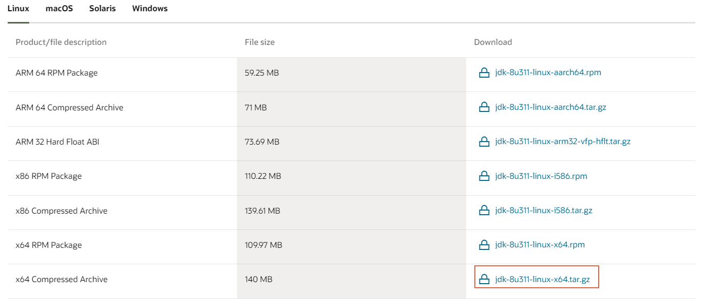

3. 윈도우에서 우분투 서버로 tar.gz파일 전송 (윈도우 커맨드창 이용)
- pscp 명령어 이용

  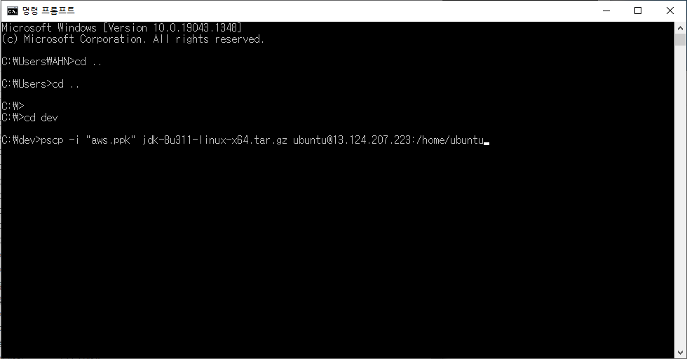
  
- ls 명령어를 사용하면 파일이 잘 전송된 것을 확인할 수 있다.

  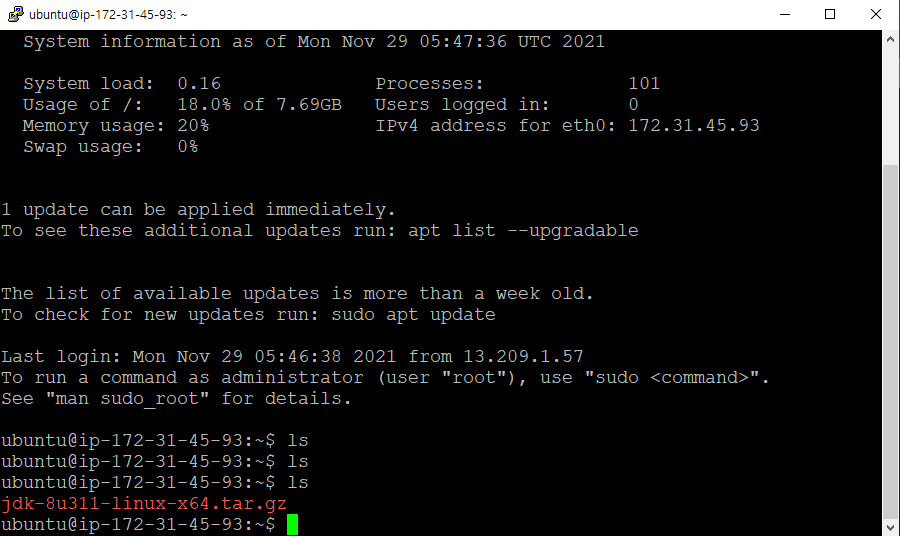
  
4. 우분투 서버에서의 자바 설치

   1. 압축해제 : `tar xvfz jdk-8u311-linux-x64.tar.gz`
   
   2. 압축해제한 파일 간단하게 이름 변경 : `mv jdk1.8.0_311 jdk1.8`

   3. 파일을 usr폴더로 이동 : `sudo mv jdk1.8 /usr/`

## 자바 환경변수 설정
1. `cd /etc/`
2. `sudo vi environement`
3. PATH 밑 자바 환경변수 추가

[ec2_web04](./images/ec2_web04.png)

5. `source /etc/environment`
6. `echo $JAVA_HOME` 확인

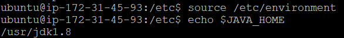

    
7. java -version 명령어를 입력했을때 버전이 잘 뜨면 설치가 잘 된 것이다.
    
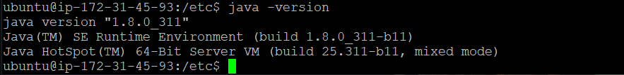

# 우분투 서버에 톰캣 설치하기

자바를 설치하고 환경변수를 설정해준것과 마찬가지로 진행하면 된다.

이번에는 리눅스의 wget 명령어를 이용해 톰캣을 설치해보겠다.

1. 톰캣사이트 다운로드의 tar.gz 링크 복사하기

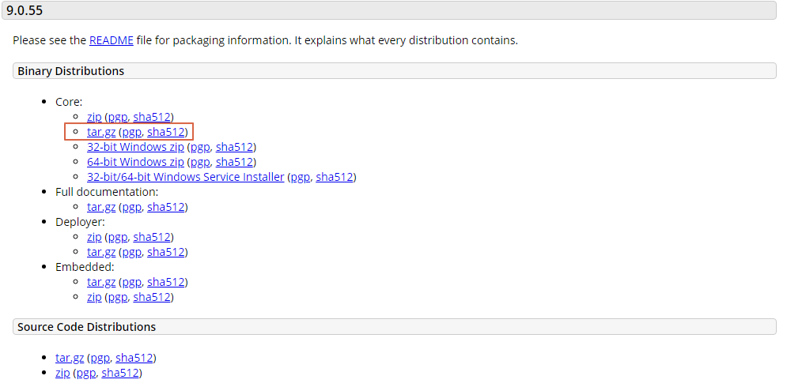

2. 터미널에 `wget 복사한 링크주소` 입력

3. 압축해제 `tar xvfz apache-tomcat-9.0.55.tat.gz`

4. 폴더이름 간단히 변경 `mv apache-tomcat-9.0.55 tomcat9`

5. 톰캣 usr폴더로 이동 `sudo mv tomcat9 /usr`

##  톰캣 환경변수 설정

1. `cd /etc/`
2. `sudo vi environement`
3. PATH 밑 톰캣 환경변수 추가

[ec2_web08](./images/ec2_web08.png)

5. `source /etc/environment`
6. `echo $ CATALINA_HOME` 확인

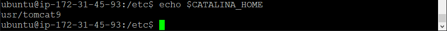

# 웹서비스 배포하기

자바와 톰캣을 우분투 서버에 설치했고 이제 .war파일을 서버로 가져온 후 톰캣 webapps폴더에 등록한 후 웹 서비스를 배포할 차례이다. 
먼저 EC2의 인바운드 규칙을 수정해야 한다. 인바운드 규칙이란 외부에서 접속할 때 적용되는 규칙이며 톰캣 포트번호인 8080과 Http의 기본 포트인 80을 추가해준다.

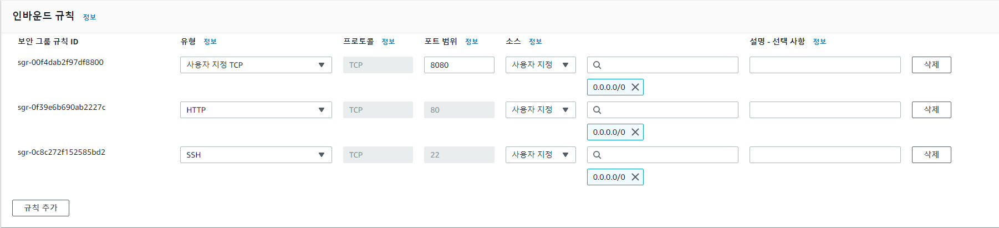

1. .war파일을 pscp 명령어를 이용해 우분투 서버로 가져온다 `pscp -i "aws.ppk" project.war ubuntu@퍼블릭IPv4주소:/home/ubuntu`

서버에서 ls명령어를 이용해 잘 가져와졌는지 확인한다.

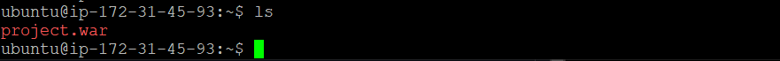

2. war파일을 톰캣하위폴더인 webapps폴더로 옮긴다. `sudo mv project.war /usr/tomcat9/webapps

3. tomcat9/bin 폴더에서 `./startup.sh` 파일을 실행한 후 주소창에 프로젝트 메인 페이지를 입력한 후 확인해본다.

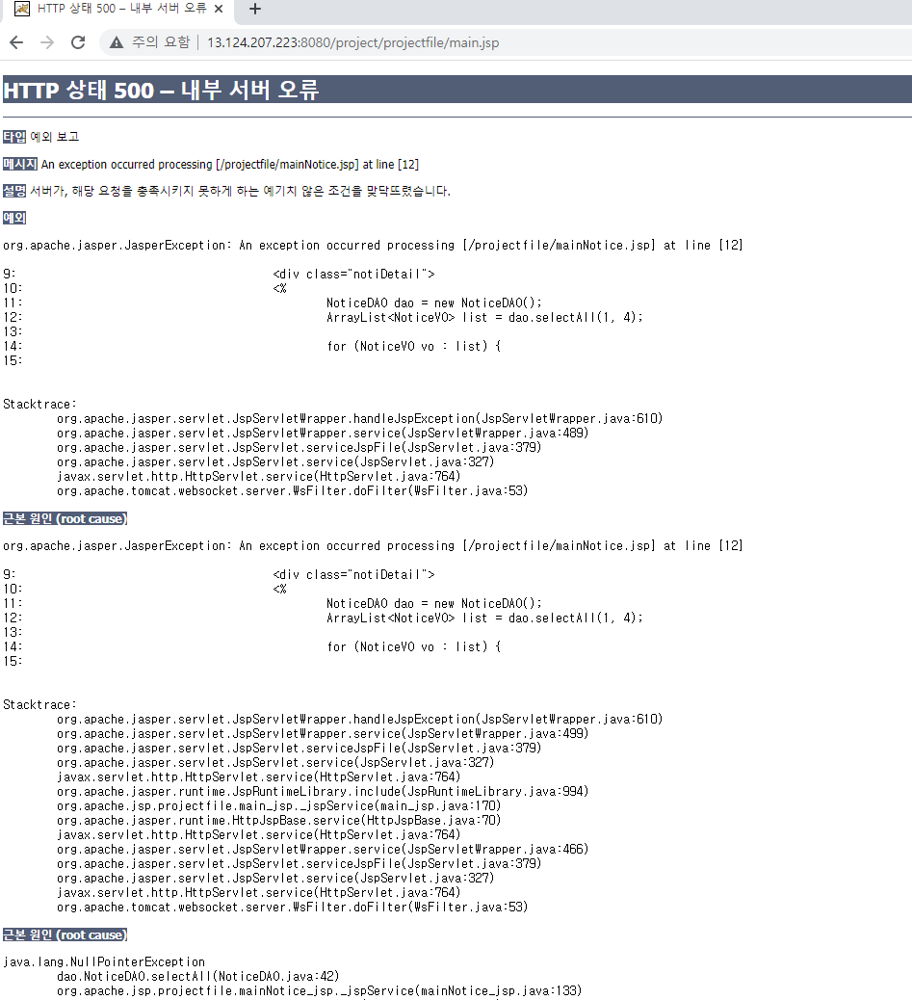

4. 다음과 같은 데이터베이스 관련 오류가 뜨는 이유는 JNDI방식을 이용해 DB정보를 작성했기 때문에 리눅스 서버에 설치한 톰캣의 server.xml 파일에 DB정보를 추가해주어야 한다.

5. `cd /usr/tomcat9/conf` 로 톰캣폴더의 하위폴더인 conf로 이동한 후 `sudo vi server.xml` vim을 켠 후 JNDI방식의 DB정보를 추가해준다.

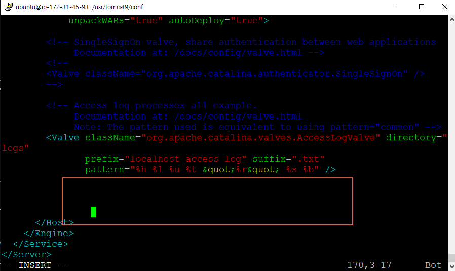

- 맨 아래 </host>태그 윗부분에 작성해준다.

6. 작성 후 톰캣을 껐다가 다시 켜준다. `cd /usr/tomcat9/bin` 이동후 `./shutdown.sh` 끈 후 `./startup.sh` 재가동해준다.

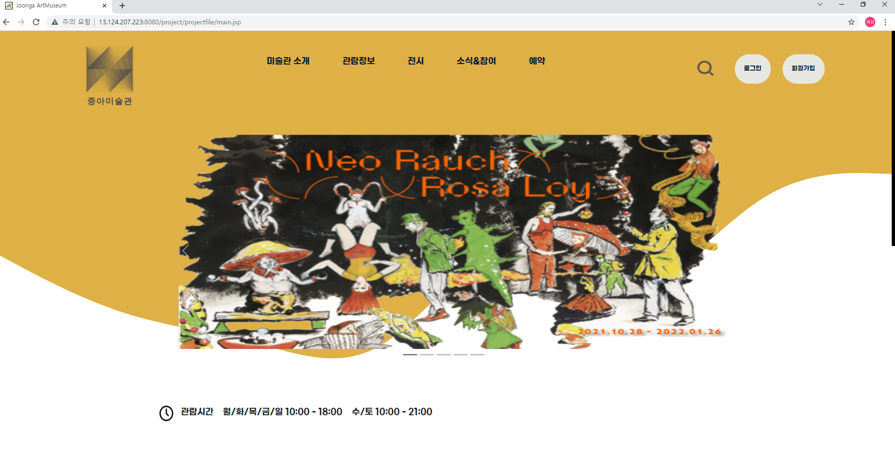

## 잘 작동하는걸 볼 수 있다!!

   
   

