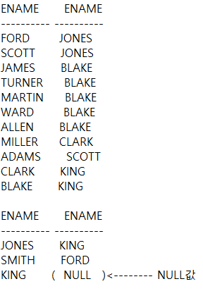

# JOIN조건
- 두 개 이상의 테이블을 연결해주는 조건
- 최소 n-1개의 조건을 만족 -> 예를 들어 3개의 테이블을 join할려면 2개의 조건을 만족해야함

## EQUI JOIN과 NON-EQUI JOIN
- EQUI JOIN :  join 연산자에 =(이퀄연산자)를 쓰는경우

```sql
SELECT E.ENAME, E.DEPTNO, D.LOC
FROM EMP E, DEPT D
WHERE E.DEPTNO = D.DEPTNO;
```
- NON-EQUI JOIN : join 연산자에 =(이퀄연산자)를 쓰지않는경우

```sql
SELECT E.ENAME, S.GRADE
FROM EMP E, SALGRADE S
WHERE E.SAL BETWEEN S.LOSAL AND S.HISAL;
```
## JOIN의 종류

### SELF JOIN
- 동일한 테이블을 join해야 하는 경우
```sql
SELECT E.ENAME, C.ENAME
FROM EMP E, EMP C;
WHERE E.MGR = C.EMPNO;
```

### OUTER JOIN
- 쿼리문 실행 결과가 NULL인 행까지 포함해 보여준다.
- NULL인 부분에 (+) 붙인다.
```sql
SELECT E.ENAME, C.ENAME
FROM EMP E, EMP C
WHERE E.MGR = C.EMPNO(+);
```
**결과**



## SQL-99 표준 

### NATURAL JOIN
- 두 테이블의 같은 조건이 1개인 경우 자연스럽게 합쳐준다.
- 조건이 되는 컬럼을 다른 절에 사용할려면 식별자 생략한다.
  - ex) E.DEPTNO (X) -> DEPTNO (O)
```sql
SELECT E.ENAME, D.DNAME, DEPTNO
FROM EMP E NATURAL JOIN DEPT D;
```

### JOIN USING
- 동일한 자료형과 컬럼명이 두개 이상이라 NATURAL JOIN을 할 수 없을때 사용

### JOIN ON
- 컬럼명이 다르고 자료형이 같은경우 사용

