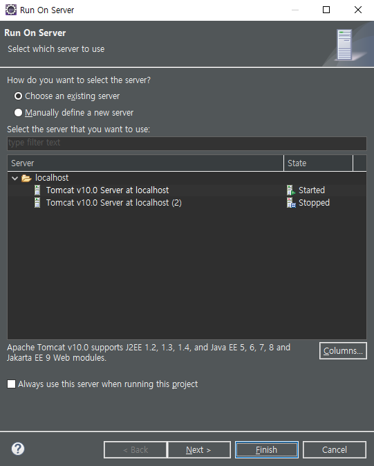
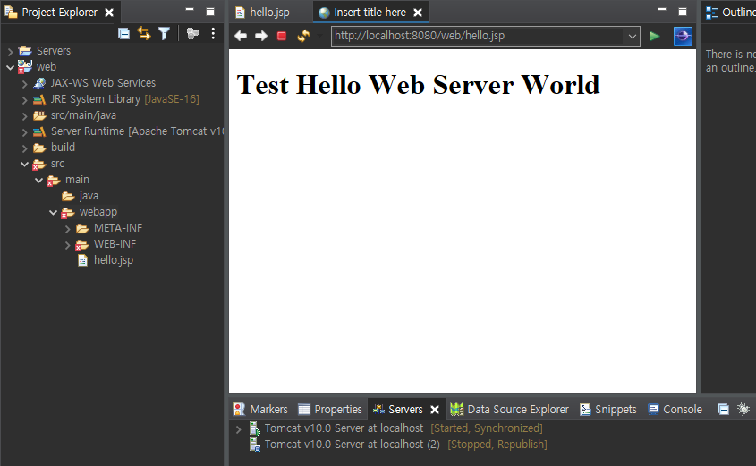

# JSP 개발환경 구축하기

**jdk와 eclipse가 다운로드 되어 있다고 가정하고 Tomcat만 설치하는 과정을 설명**
 
 
 ## 1. Tomcat 다운로드
<http://tomcat.apache.org/>

각자 알맞은 개발 환경에 맞는 버전을 설치해서 다운로드한다.
  
설치 후 apache-tomcat-버전 폴더가 생기는데 사용할 디렉토리로 압축을 풀어준다.(필자는 zip파일을 다운로드받음)
  
## 2. 환경변수 설정

시스템 속성 > 환경 변수 > 시스템 변수에 새로 만들기 > 두가지 환경변수를 설정해준다.

1. 변수 이름에는 CATALINA_HOME, 변수 값에는 다운로드 받은 apache-tomcat-버전 폴더 경로를 적어준다.
2. 변수 이름에는 JAVA_HOME, 변수 값에는 jdk가 설치되어 있는 경로를 적어준다.

## 3. 인코딩 설정

apache-tomcat폴더 > conf > server.xml 파일 실행(메모장으로 실행)

ctrl + f 누른 후 8080 입력 후 엔터 두번

Connector port 부분이 나올텐데, 다음과 밑줄친 부분과 같이 추가해준다. **(URL 이 아니라 URI(대문자i) 이다 주의 !!)**

이클립스를 실행한다.

기존의 작업을 하던 Workspace와 다른 새로운 Workspace를 생성하고 실행해준다. ( 새로운 Workspace 폴더를 사용할 디렉토리에 생성해준다. )

왼쪽 상단 목록의 File > Switch Workspace > other.. 클릭

web 개발을 위한 새로운 Workspace 로 Switch해준다.

새로운 Workspace에서 

window > Preferences > 검색창에 enc 입력

위의 이미지 왼쪽 목록에서 CSS Files, HTML Files, JSP Files, XML Files 의 인코딩을 모두 UTF-8로 변경해준다.

## 4. 이클립스 프로젝트 생성

이클립스 왼쪽면의 project Explorer 에서 마우스 오른쪽 클릭 > New > Dynamic Web Project를 선택

Project name 에 프로젝트 이름을 적어준다.

Project location 에는 해당 Workspace의 경로가 자동으로 지정된다.

Target runtime은 처음 설정할때는 비어있다. 따라서 옆에 New Runtime... 버튼을 눌러준다.

설치했던 Tomcat의 버전을 선택하고 아래 Create a new local server에 체크해준다. > Next 클릭

Tomcat installation directory: 부분에 Browse버튼을 클릭해 설치된 Tomcat 파일의 경로를 지정해준다. > Finish 클릭

설정을 완료하면 다음과 같이 Servers폴더와 생성한 web폴더가 생성된다!

테스트용으로 webapps폴더에 hello.jsp 파일을 작성하고 실행해 볼 것이다.

마우스 오른쪽 클릭 > Run As > Run on Server 클릭

Finish 버튼 클릭한다.

다음과 같이 이클립스 내부 브라우저에서 실행된다.

다른 웹 브라우저로 열리게 설정을 할려면

상단 Window > Web Browser > 웹 브라우저 선택 ( 필자는 크롬으로 설정 )

## cmd 창에서 Tomcat 실행(관리자 권한으로 실행)

apache 폴더 내의 bin 폴더까지 경로를 지정해주고 startup.bat 파일을 실행해준다

실행 후 이상한 외계어가 가득한 cmd창이 추가로 생성되는데 Tomcat이 잘 실행된 것이다.

Tomcat이 잘 실행됐는지 확인하려면 웹 브라우저에 http://localhost:8080 입력한다.

다음과 같은 창이 뜨면 Tomcat이 잘 실행된것이다.

 
