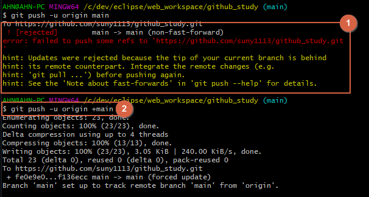

# 원격 저장소와 로컬 저장소 연결

### 1. 깃허브에 레파지토리 생성

### 2. 레파지토리 생성 후 주소 복사하기

### 3. 원격 저장소에 백업할 로컬 저장소의 프로젝트 경로로 이동

1. `git init` 명령어로 깃을 초기화시켜준다.
2. `git branch -M main` 명령어로 master 브랜치명을 main으로 변경해준다.
3. `git remote add origin 복사한주소` 명령어로 로컬과 원격을 연결해준다.

### 4. `git remote -v` 명령어로 잘 연결되었는지 확인한다.

### 5. 로컬저장소 add 및 commit 후 push 명령어로 원격 저장소에 잘 백업되는지 확인하기

1. `git push -u origin main` 명령어가 오류가 나는 이유는 처음에 원격 레파지토리를 생성할 때 .gitignore 파일을 생성했기 때문이다.  
  원격 저장소에 README.md 파일이나 다른 파일들을 생성한 후 로컬과 연결한 뒤 로컬에서 원격으로 push를 할때 데이터 유실 등의 문제가 있을 수도 있어서 오류가 발생하는 것이다.
  
2. 따라서 원격 저장소를 초기에 생성할 때 아무 파일도 생성하지 말고, 로컬에서 처음 push를 하기 전에 .gitignore 파일이나 README.md 파일을 만들어서 같이 push하는게 바람직하다.
  `git push -u origin +main` +는 강제로 push하겠다는 뜻으로 임시방편으로 오류를 해결했다.
  
  
### 6. 원격저장소에 push한 파일들이 잘 올라와졌다.

