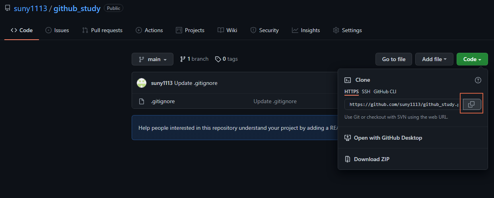

# 버전과 만드는 단계
- 버전은 프로그램 개발 과정에서 수정내용이 쌓이면 이전 상태와 구분짓기 위해 구별한 것
- 깃에서 버전은 수정하고 저장할때마다 생기는 것

## Stage와 Commit

- 작업트리 : 파일 수정, 저장등의 작업 수행하는 디렉터리
- 스테이지 : 버전으로 만들 파일이 대기하는 곳
- 저장소(레파지토리) : 파일들이 버전으로 만들어져서 저장되는곳

## tracked 파일과 untracked 파일
- tracked : 추적되고있는, 즉 이전에 한번이라도 버전관리(커밋)을 했던 파일을 가리킨다.
- untracked : 추적되고있지않는, 이전에 버전관리(커밋)을 한번도 하지 않은 파일을 가리킨다.

## unmodified, modified, staged 상태

- unmodified : 파일이 수정되지 않은상태
- modified : 파일이 수정된 상태
- staged : 파일이 스테이지에 올라간 상태

### 스테이징, 커밋 명령어
- 스테이지에 수정한 파일 추가 : git add
- 커밋 메세지와 함께 커밋 : git commit -m "커밋내용"
- 스테이징과 커밋 동시 : git commit -am "커밋내용" (tracked 파일만 사용가능한 명령어) 
- 방금 커밋한 메세지 수정 : git commit --amend

## 작업 되돌리기 명령어
- 작업 트리에서 수정한 파일 수정취소 : git checkout
- 스테이징 취소 : git reset HEAD 파일이름 (파일이름 지정하지 않으면 스테이지에 있는 모든 파일 되돌림)
- 최신 커밋 취소 : git reset HEAD^
- 특정 커밋으로 되돌리기 : git reset 커밋해시 ( 그 특정 커밋 이후 버전은 삭제됨 )
- 커밋 삭제하지 않고 되돌리기 : git revert

### reset과 revert의 차이
- reset은 되돌아갈 커밋 해시를 지정, revert는 취소할 커밋 해시를 지정

## 깃 상태정보 명령어
- git status : 현재 깃 상태 확인
- git log : 커밋 기록 살펴보기
- git log --stat : 커밋에 관련된 파일까지 함께 보기
- git diff : 변경 사항 확인

