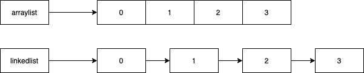
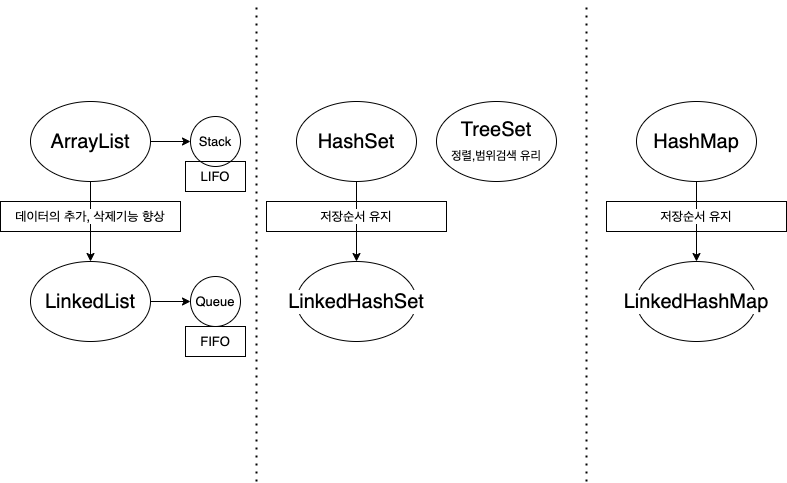

>'자바의정석 기초편 - 남궁성' 11장학습
>> 1. collections framework
>> 2. List 인터페이스<br>
>> 2-1. ArrayList<br>
>> 2-2. LinkedList<br>
>> 2-3. Stack과 Queue<br>
>> 3. Set 인터페이스<br>
>> 3-1. HashSet<br>
>> 3-2. TreeSet
>> 4. Map 인터페이스<br>
>> 4-1. HashMap
>> 5. Iterator
>> 6. Comparator와 Comparable


## 1. 컬렉션 프레임웍이란?
- 다수의 데이터 군을 저장하는 클래스들을 표준화한 설계
- 다수의 데이터를 다루는 데 필요한 다양한 클래스들을 제공한다.

## 2. List 인터페이스
- 중복을 허용하고, 순서를 유지한다.
- ArrayList, LinkedList, stack 등..

### 2-1. ArrayList
- 컬렉션에서 가장 많이 사용된다.
- 저장순서가 유지되고, 중복을 허용한다.
- 데이터를 읽는 속도가 빠르다.
- 순차적인 데이터 추가,삭제가 빠르지만 비순차적인 데이터 추가,삭제가 느리다.

### 2-2 LinkedList
- 데이터가 불연속적으로 존재한다.
- 데이터를 읽는 속도가 느리다.
- 비순차적인 데이터의 추가, 삭제가 유리하다.(빠르다)

### ArrayList와 LinkedList의 구조

### 2-3 Stack과 Queue
### Stack
- 최근에 저장한 데이터를 가장 먼저 꺼내는 Last In First Out 구조
- 순차적인 데이터 추가, 삭제가 용이한 ArrayList 클래스를 사용
- 클래스로 구현되어있다.

### Queue
- 맨 처음에 저장한 데이터를 가장 먼저 꺼내는 First In First Out 구조
- 항상 처음에 저장한 데이터를 먼저 꺼내기 때문에 데이터의 추가/삭제가 유리한 LinkedList로 구현
- 인터페이스이며, Queue를 구현한 클래스들 중 하나를 선택해서 사용한다.

## 3. Set 인터페이스
- 중복을 허용하지 않고, 순서를 유지하지 않는다.
- HashSet, LinkedHashSet, TreeSet 등..

### 3-1. HashSet
- Set 인터페이스를 구현한 가장 대표적인 컬렉션
- 저장순서를 유지하지 않기 때문에 순서를 유지할려면 LinkedHashSet을 사용한다.

### 3-2 TreeSet
- 이진 탐색 트리의 자료구조 형태로 데이터를 저장한다.
- 정렬, 검색, 범위정렬에 높은 성능을 보인다.

## 4. Map 인터페이스
- key(중복불가)와 value(중복허용)값이 한 쌍으로 이루어져 있다.

### 4-1. HashMap
- key와 value값을 각각 객체로 저장한다.

## 5. Iterator 
- 컬렉션의 저장된 요소에 접근할때 사용하는 인터페이스
- 사용예제
```java
class CollectionEx{
  public static void main(String args[]){
      ArrayList list = new ArrayList();
      
      list.add(1);
      list.add(2);
      list.add(3);
      list.add(4);
      list.add(5);
      
      Iterator it = list.Iterator();
      while(it.hasNext()){
        Object obj = it.next();
        System.out.println(obj);
      }
  }
}
```

## 6. Comparator와 Comparable

### Comparator
- 기본 정렬기준 외의 다른 정렬을 사용하고자 할때 사용
- compare 메서드를 구현해야 한다.

### Comparable
- 기본 정렬기준을 구현하는데 사용
- 주로 wrapper클래스와 String, Date 등의 클래스들에 오름차순으로 정렬되도록 구현되어 있다.

```java
String[] sArr = {"apple", "grape", "Banana", "orange"};

// Comparable 구현에 의한 정렬
Arrays.sort(sArr); // String클래스에 구현되어 있는 Comparable에 의한 정렬
// 결과 : Banana, apple, grape, orange

// Comparator 구현에 의한 정렬
Array.sort(sArr, String.CASE_INSENSITIVE_ORDER); // 대소문자 구분 안함
// 결과 : apple, Banana, grape, orange

```

## Collections 그림

