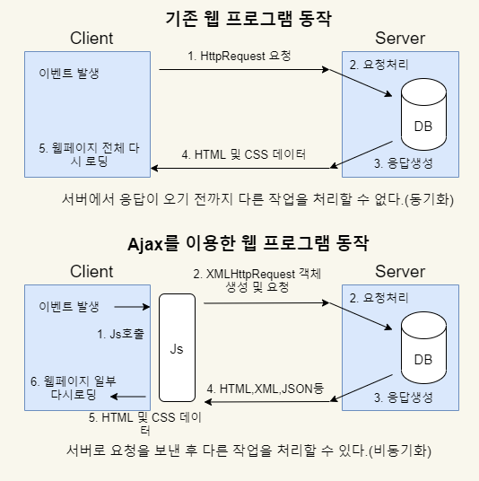

# Ajax (Asynchronous Javascript and XML)
- 빠르게 동작하는 동적인 웹 페이지를 만들기 위한 개발 기법
- 웹 페이지 전체를 로딩하지 않고 웹 페이지의 일부만 갱신할 수 있다.
- 백그라운드 영역에서 서버와 통신하여 그 결과를 웹 페이지의 일부분에만 표시할 수 있다.
- JSON, XML, HTML, 텍스트파일 등 다양한 형태의 데이터를 주고받을 수 있다.

## Ajax 동작 원리



- 기존의 웹 응용 프로그램은 서버에서 응답이 오기 전까지 다른 작업을 할 수 없다.
- Ajax를 이용한 통신은 사용자의 동작에 영향을 주지 않고 서버와 지속적으로 통신할 수 있다.

## XMLHttpRequest  객체 생성

```javascript
<script>
  function getXMLHttpRequest(){
     if(window.ActiveObject){
        try{
            return new ActiveObject("MsXML2.XMLHttp");
        }catch(e1){
            try{
                return new ActiveObject("Microsoft.XMLHttp");
            }catch(e2){
                null;
            }
        }
     }else if(window.XMLHttpRequest){
        return new XMLHttpRequest();
     }else{
        return null;
     }
  }// getXMLHttpRequest() end
</script>
```

- `MsMXL2.XMLHttp`와 `Microsoft.XMLHttp` 객체를 생성하는 경우는 MS브라우저를 이용하는 경우이다.
- 그 외의 브라우저들(크롬, 사파리 등)은 XMLHttpRequest 객체를 생성한다.


## 이벤트 발생 함수, 서버에 요청 및 응답
```javascript
<script>
  var xhr = null;
  function getXMLHttpRequest(){
     if(window.ActiveObject){
        try{
            return new ActiveObject("MsMXL2.XMLHttp");
        }catch(e1){
            try{
                return new ActiveObject("Microsoft.XMLHttp");
            }catch(e2){
                null;
            }
        }
     }else if(window.XMLHttpRequest){
        return new XMLHttpRequest();
     }else{
        return null;
     }
  }// getXMLHttpRequest() end
  
  function load(url){
    // 전역변수 xhr에 XMLHttpRequest객체 대입
     xhr = getXMLHttopRequest();
     // 대기하고 있다가 응답이 오면 함수 실행, callback 함수
     xhr.onreadystatechange=function(){
        if(xhr.readyState == 4){ // 통신완료라면?
            if(xhr.status == 200){ // 정상페이지라면?
                document.getElementByID("div1").innerText = xhr.responseText; // 아이디가 div1 태그에 innerText값으로 응답을 출력한다.
            }
        }
     }
     // open(GET 방식, 주소, 비동기통신)
     xhr.open("GET", url, true); // get방식으로 url에 접근하는 비동기방식으로 통신, false면 동기식으로 요청함.
     
     xhr.send(null);
  }
</script>
```

### 서버로부터 응답을 확인하는 XMLHttpRequest객체의 속성
#### ●readyState (객체의 현재 상태)
|값(숫자)|설명|
|---|---|
|0|XMLHttpRequest 객체가 생성됨|
|1|open()이 성공적으로 실행|
|2|모든 요청에 대한 응답이 도착|
|3|요청한 데이터를 처리중|
|4|요청한 데이터 처리가 완료되고 응답할 준비 완료|

#### ●status (서버의 문서 상태)
|값|설명|
|--|----|
|200|서버에 문서가 존재|
|404|서버에 문서가 존재하지 않음|

#### ●onreadystatechange
- XMLHttpRequest객체의 readyState속성값이 바뀔때마다 자동으로 호출되는 함수

## jQuery 이용한 Ajax (img 태그 이용)

```javascript
<script src="https://ajax.googleapis.com/ajax/libs/jquery/3.6.0/jquery.min.js"></script> // cdn
<script>
    $(function(){
      $("img").on("click", function(){
            $.ajax({
              type : "GET",
              async : true,
              url : "전송할 url",
              dataType : "html",  // 전송받을 데이터, html, XML, JSON
              data  : {"name값" : value값},
              success : function(response, status, request){
                  // 전송 성공시에 처리할 코드
              },
              error : function(response, status, request){
                  // 에러 발생할때 처리할 코드 
               }
              
            }) // JSON타입
      }
    
    })
</script>
```

