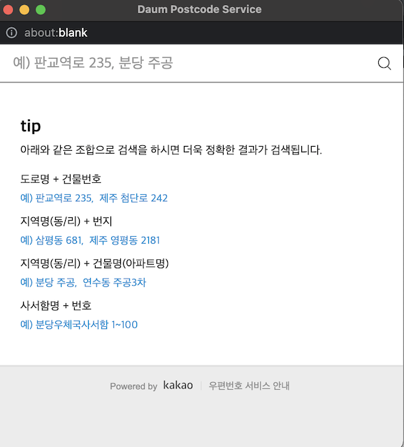

# 카카오의 우편번호 서비스

<https://postcode.map.daum.net/guide>

- 카카오에서 제공하는 우편번호 검색 서비스
- 기업용, 상업용으로 무료 배포
- 홈페이지에 들어가면 사용할 수 있는 cdn 주소와 속성값들을 확인할 수 있다.
- 자바스크립트를 이용하여 작성

## 사용법예제 (HTML코드는 생략하였다.)
```javascript
<script src="//t1.daumcdn.net/mapjsapi/bundle/postcode/prod/postcode.v2.js"></script>
<script>
	window.onload = function(){
		var btn = document.getElementById("btn");
		btn.onclick = function(){
			new daum.Postcode({  <!-- JSON타입으로 생성 -->
				oncomplete : function(data){
					console.dir(data)
					document.getElementById("post1").value = data.zonecode;
					document.getElementById("addrs").value = data.address;
					document.getElementById("addrs2").value = data.jibunAddress;
				}
			}).open();
		}
	}
</script>
```

- 링크를 눌러 cdn주소를 복사한 후 붙여넣는다.
- 함수 생성 후 console.dir(data)를 콘솔에 출력하면 사용할 수 있는 속성값들을 볼 수 있다.(홈페이지에서도 볼 수 있다)

### 사용한 속성
- zonecode : 우편번호
- address : 도로명주소(신주소)
- jibunAddress : 지번주소(구주소)

## 예제 실행 화면


우편번호 찾기 버튼 클릭하면 



다음과 같은 화면이 나온다.


도로명주소 클릭 또는 지번주소 클릭


결과화면


