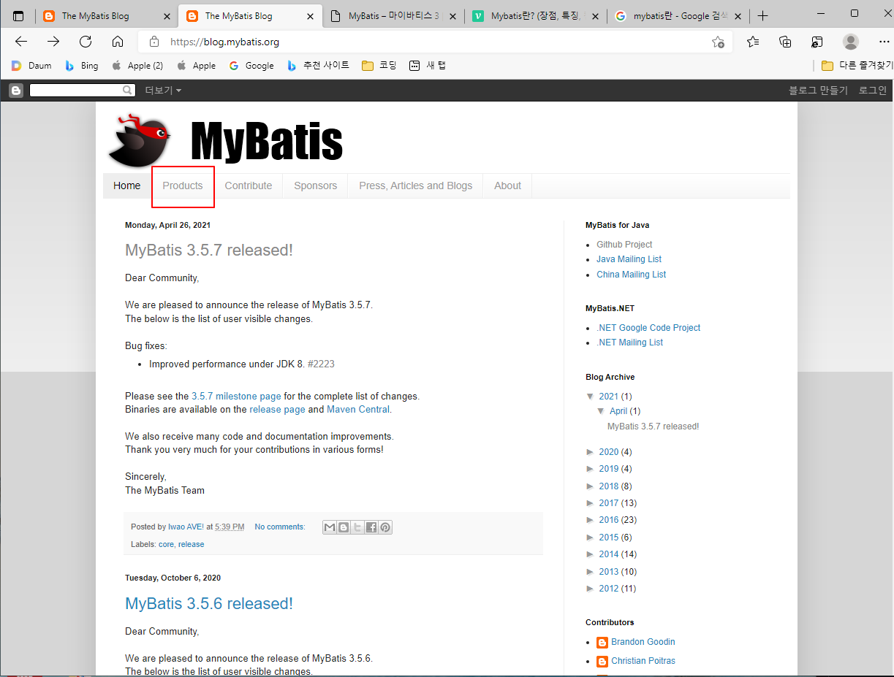
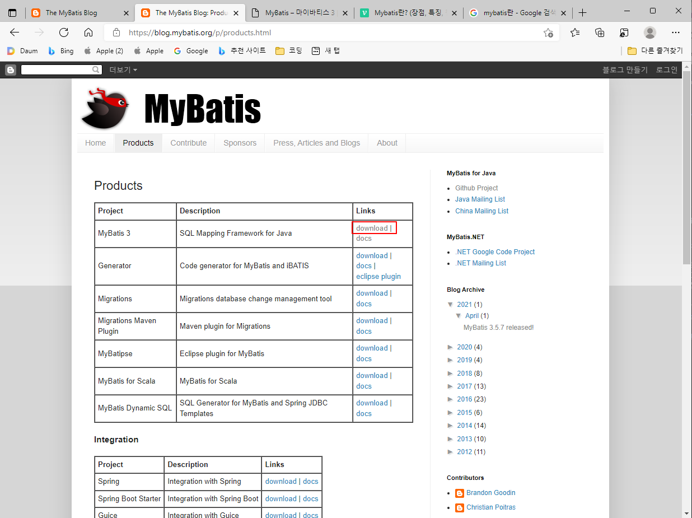
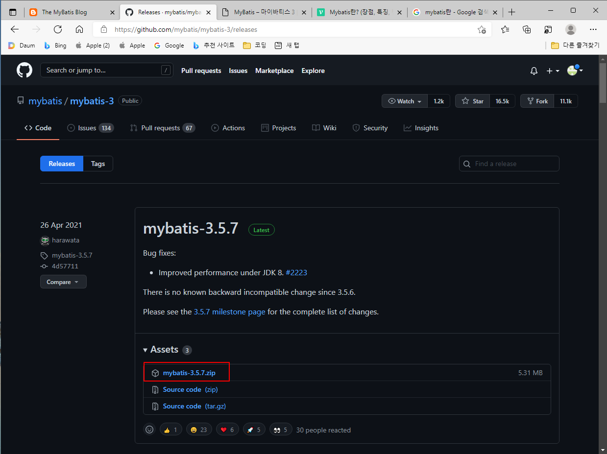
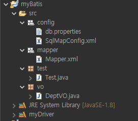
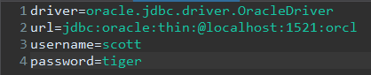

# MyBatis란 무엇인가?
- 관계형 데이터베이스 프로그래밍을 좀 더 쉽게 할 수 있게 도와주는 퍼시스턴스 프레임워크
- JDBC로 처리하는 상당부분의 코드와 파라미터 설정 및 결과 매핑을 대신해준다.
- SQL문과 자바 코드가 분리되어있어 SQL문이 변경되어도 코드를 수정할 필요가 없다.
- 쉬운 접근성과 코드가 간결해 유지보수가 편리하다.

## MyBatis 다운로드
1. https://blog.mybatis.org MyBatis 홈페이지로 이동

2. Products 클릭 <br>
 

3. 해당 버전으로 download 클릭 <br>
 
4. zip파일 다운로드<br>

5. 다운로드받은 jar파일 라이브러리에 추가

## MyBatis 초기설정
- MyBatis를 사용하기 위해서는 초기 환경설정과 관련된 파일을 작성해야 한다.

### 환경설정파일
- 일단 실습용으로 만든 프로젝트와 패키지명이다. <br>
 

- db관련정보를 작성한 db.properties 파일이다. <br>
 

#### 1. MyBatis 설정파일(SqlMapConfig.xml) : 데이터베이스의 접속 주소 정보나 Mapping파일의 경로 등 환경정보를 설정한다.

```xml
<?xml version="1.0" encoding="UTF-8"?>
<!DOCTYPE configuration
  PUBLIC "-//mybatis.org//DTD Config 3.0//EN"
  "http://mybatis.org/dtd/mybatis-3-config.dtd">
<configuration>
	<properties resource="config/db.properties" />
	
	<!-- 환경정보 -->
	<environments default="dev">
		<environment id="dev">
			<!-- 트랜잭션 관리는 JDBC 방식 -->
			<transactionManager type="JDBC" />
			<!-- 커넥션 풀 방식 사용 -->
			<dataSource type="POOLED">
				<!-- db정보 -->
				<property name="driver" value="${driver}"/>
				<property name="url" value="${url}"/>
				<property name="username" value="${username}"/>
				<property name="password" value="${password}"/>
				
			</dataSource>
		</environment>
	</environments>
	
	<!-- sql문을 작성할 Mapper.xml파일 매퍼로 등록 -->
	<!-- sql문을 작성할 xml파일이 여러개라면 여러개를 등록해야함 -->
	<mappers>
		<mapper resource="mapper/Mapper.xml"/>
	</mappers>
	
</configuration>
```
-  상단의 config.dtd는 MyBatis 홈페이지-시작하기 에서 얻을 수 있다.

#### 2. Mapping파일(user.xml) : SQL문을 작성할 파일
 - 간단하게 dept테이블의 데이터를 조회하는 sql문을 작성하였다.
```xml
<?xml version="1.0" encoding="UTF-8"?>
<!DOCTYPE mapper
  PUBLIC "-//mybatis.org//DTD Mapper 3.0//EN"
  "http://mybatis.org/dtd/mybatis-3-mapper.dtd">

<!-- MyBatis에서 모든 namespace값은 항상 존재하야 한다. 공백이라도 존재해야함. -->
<mapper namespace="kr.co.test">
	<!-- dept테이블 전제 데이터 조회 -->
	<!-- 
		id : 기존의 JDBC방식의 DAO클래스의 메서드명이라 생각하면 편하고 해당되는
		     SQL문을 불러올 속성명을 지정하면 된다.
		
		parameterType : 파라미터로 받아올 값의 타입을 지정
		
		resultType : 반환할 데이터의 타입을 지정
	 -->
	<select id="selectDeptAll" resultType="vo.DeptVO">
		SELECT *
		FROM dept
	</select>
</mapper>
```

## MyBatis 컴포넌트로 데이터베이스 접근하기
- 기존의 JDBC방식에서 데이터베이스를 Connection을 이용해 접근했다면 MyBatis에서는 SqlSessing을 이용한다.
- 주요 컴포넌트

|컴포넌트|설명|
|--------|----|
|SqlSessionFactoryBuilder|SqlSessionFactory를 생성하는 클래스|
|SqlSessionFactory|SqlSession 객체를 실행하는 팩토리 인터페이스|
|SqlSession|매퍼에 등록된 SQl문을 실행하고 트랜잭션을 관리하는 인터페이스

- SqlSession의 주요 메서드

|메서드|설명|
|------|----|
|selectOne| select문이 실행된 하나의 객체를 리턴|
|selectList| select문이 실행되어 여러개의 객체가 담긴 리스트를 List 인터페이스로 반환|
|selectMap| select문의 결과가 Map으로 변환되어 반환|
|insert| insert문이 실행된 결과 레코드가 반환|
|update| update문이 실행된 결과 레코드가 반환|
|delete| delete문이 실행된 결과 레코드가 반환|

```java
package test;

import java.io.IOException;
import java.io.Reader;
import java.util.List;

import org.apache.ibatis.io.Resources;
import org.apache.ibatis.session.SqlSession;
import org.apache.ibatis.session.SqlSessionFactory;
import org.apache.ibatis.session.SqlSessionFactoryBuilder;

import vo.DeptVO;

public class Test {
	public static void main(String[] args) {
		
		try {
			// 1. 환경설정파일 읽어오기 (설정파일의 경로로 지정)
			Reader reader = Resources.getResourceAsReader("config/SqlMapConfig.xml");
			
			// 2. SqlSessionFactoryBuilder 객체 생성
			SqlSessionFactoryBuilder ssfb = new SqlSessionFactoryBuilder();
			
			// 3. SqlSessionFactory
			SqlSessionFactory factory = ssfb.build(reader);
			
			// 4. Reader 자원반납
			reader.close();
			
			// 5. SqlSession 생성 (openSession 메서드의 매개변수가 true면 오토커밋을 의미)
			SqlSession ss = factory.openSession(true);
			
			// namespace의 이름과 해당 sql문의 id속성명을 지정
			List<DeptVO> list = ss.selectList("kr.co.test.selectDeptAll");
			
		} catch (IOException e) {
			// TODO Auto-generated catch block
			e.printStackTrace();
		}
	}
}

```
