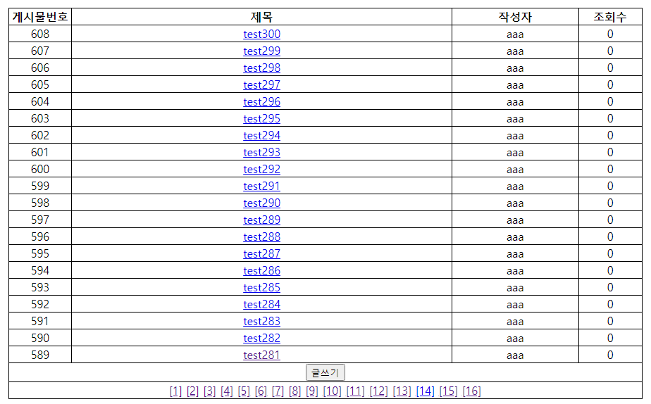

# 게시판 페이지 
- 게시판을 만드는 과정에서 게시물 목록들을 일정한 갯수대로 나열하고 페이지를 이동시키는 방법


- 일단 목표로 하는 게시판의 화면이다.
- 총 게시글 수와 한 페이지에 나열할 게시글의 수, 총 몇 페이지로 나누어야 할지를 정해야 한다.

### 총 게시글 수
- db에 저장된 게시글의 총 개수를 알려면 sql의 count함수를 이용하면 된다.

`SELECT COUNT(*) cnt FROM board;`

- board 테이블의 총 갯수를 구하기 위해 COUNT(*) 함수를 이용하였다.
- cnt로 별칭을 지정해 준 다음 값을 가져온 다음 int totalCount의 값으로 받아준다.
```java
public int getTotal() {
		sb.setLength(0);
		sb.append("SELECT COUNT(*) cnt FROM BOARD ");
		int count = 0;
		try {
			pstmt = conn.prepareStatement(sb.toString());
			
			rs = pstmt.executeQuery();
			rs.next();
			count = rs.getInt("cnt");
		} catch (SQLException e) {
			// TODO Auto-generated catch block
			e.printStackTrace();
		}
		return count;
	}
  
  BoardDAO dao = new BoardDAO();
	
// 총 게시물 수
int totalCount = dao.getTotal();
```
### 한 페이지에 나열할 게시글 갯수
- `int perPage = 20;` 한 페이지에 20개씩 게시글을 나열하기 위해 변수를 선언하였다.

### 총 페이지 수
- 이제 총 페이지 수를 구할 수 있다. 
- '총 게시글/한 페이지에 나열할 게시글' 을 계산하면 된다.
- 만약 총 게시글을 20으로 나누었는데 나누어 떨어지지 않고 나머지가 나온다면 +1을 해준다
- ex) 302/20 = 15페이지+2게시글 ==> 16페이지로 만들기
- `int totalPage = (totalCount%perPage ==0) ? totalCount/perPage : totalCount/perPage +1;`

### 게시물 목록 나누기
1. DB에서 게시물을 20개씩 가져와야 한다.
2. 1페이지가 1 ~ 20개, 2페이지가 21 ~ 40개, 3페이지가 41 ~ 60개 ...
3. `게시물 시작번호 = (currentPage-1)*perPage+1;`
4. `게시물 끝번호 = currentPage*20;`

### DB에서 게시글을 20개씩 가져오기
- inline view가 두번 쓰인 sql문이기 때문에 조금 복잡하다.
- 끝범위 까지를 먼저 구하고
- 시작범위를 지정하는 순서로 작성한다.
```sql
SELECT RN, BNO, WRITER, TITLE, CONTENTS, REGDATE, HITS, IP, STATUS
FROM (SELECT ROWNUM RN, BNO, WRITER ,TITLE, CONTENTS, REGDATE, HITS, IP, STATUS
FROM (SELECT BNO, WRITER ,TITLE, CONTENTS, REGDATE, HITS, IP, STATUS FROM BOARD ORDER BY BNO DESC)
WHERE ROWNUM <= 끝번호)
WHERE RN >= 시작번호;
```

- ROWNUM의 RN을 별칭으로 지정해주었다.

## 맨 아래의 페이지 번호
- for문을 총 페이지개수까지 돌리면 구할 수 있다.
```java
for (int i = 1; i <= totalPage; i++){
	//...		
}
```


## 게시판의 자세한 코드는 다음 링크를 참고
<https://github.com/suny1113/study-code/tree/main/Servlet_JSP/src/main/webapp/board>
