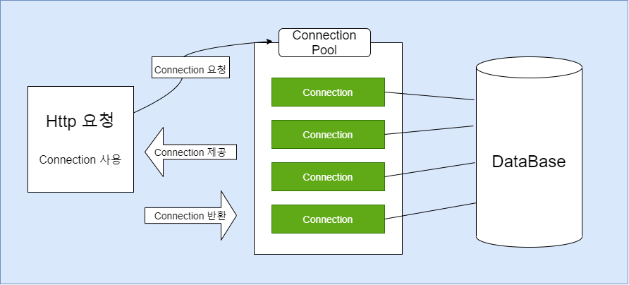
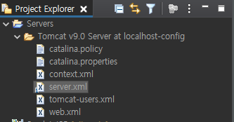

# JDBC의 커넥션 풀(Connection Pool) 방식

## DBCP (DataBase Connection Pool)
- 데이터베이스와 연결된 Connection을 미리 만들어서 저장해두고 있다가 필요할 때 저장된 공간(Pool)에 가져다 쓰고 반환하는 기법
- Connection 객체 생성과 삭제에 드는 비용을 줄이기 위한 객체 재활용 방식



- Connection 객체에 일정량 모아둔 Pool을 생성해두고 계속 재활용하는 방식

## JNDI (Java Naming and Directory Interface)
- 커넥션 풀 방식을 사용하기 위해서는 사용할 데이터베이스의 Pool을 미리 네이밍 시켜주어야 한다.
- Web Application Server의 설정 파일에 데이터베이스의 관련 정보를 입력해주면 된다.
- 소스코드에 노출될수도 있는 중요한 자원을 감출 수 있고( db의 아이디나 비밀번호 ), 서버 설정 파일에서 관련 정보를 한번에 설정해 주는 것이 자원 낭비를 막을 수 있다.
- 관리, 운영면에서 유리하다.

### server.xml파일에서 db관련 정보 네이밍하기 (WAS는 Tomcat9버전을 사용)



- server.xml 파일을 연다.
```xml
<Context></Context> 안에
<Resource  auth="Container"
           driverClassName="oracle.jdbc.driver.OracleDriver"
           name="jdbc/myoracle"
           username="scott"
           password="tiger"
           type="javax.sql.DataSource"
           url="jdbc:oracle:thin:@localhost:1521:orcl"/>
```

- Connection Pool 설정값

|설정값|설명|
|------|-----|
|initialSize|최초 호출시 커넥션 풀에 채워 넣을 커넥션 개수(기본값0)|
|maxActive|동시에 사용할 수 있는 최대 커넥션 개수(기본값8)|
|maxIdle|커넥션풀에 반납할 때 최대로 유지할 수 있는 커넥션 개수(기본값8)|
|minIdle|최소한으로 유지할 커넥션 개수(기본값0)|
|maxWait|커넥션 풀에 커넥션이 고갈되었을때 커넥션 반납을 대기하는 시간|


## Connection Pool 생성하기 (emp테이블의 정보를 가져오는 예시)

```java
public class EmpDAO {
	
	DataSource ds;
	PreparedStatement pstmt;
	StringBuffer sb = new StringBuffer();
	ResultSet rs;
	
	public EmpDAO() {
		try {
			Context initContext = new InitialContext();
			Context envContext = (Context) initContext.lookup("java:/comp/env");
			ds = (DataSource)envContext.lookup("jdbc/myoracle");
			
		} catch (NamingException e) {
			// TODO Auto-generated catch block
			e.printStackTrace();
		}
	}
	
	public ArrayList<EmpVO> selectAll(){
		sb.setLength(0);
		sb.append("SELECT empno, ename, job, mgr, hiredate, sal, comm, deptno ");
		sb.append("FROM emp ");
		ArrayList<EmpVO> list = new ArrayList<EmpVO>();
		
			try {
				Connection conn = ds.getConnection();
				pstmt = conn.prepareStatement(sb.toString());
				rs = pstmt.executeQuery();
				
				while(rs.next()) {
					int empno = rs.getInt("empno");
					String ename = rs.getString("ename");
					String job = rs.getString("job");
					int mgr = rs.getInt("mgr");
					String hiredate = rs.getString("hiredate");
					int sal = rs.getInt("sal");
					int comm = rs.getInt("comm");
					int deptno = rs.getInt("deptno");
					list.add(new EmpVO(empno, ename, job, mgr, hiredate, sal, comm, deptno));
				}
				conn.close();
			} catch (SQLException e) {
				// TODO Auto-generated catch block
				e.printStackTrace();
			}
		return list;
	}
}
```
- 쿼리문을 실행하고 난 후 Connection 자원을 꼭 반납해주는 것을 잊지말자.


