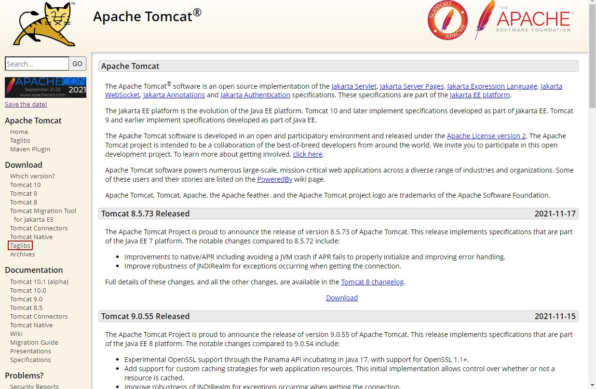
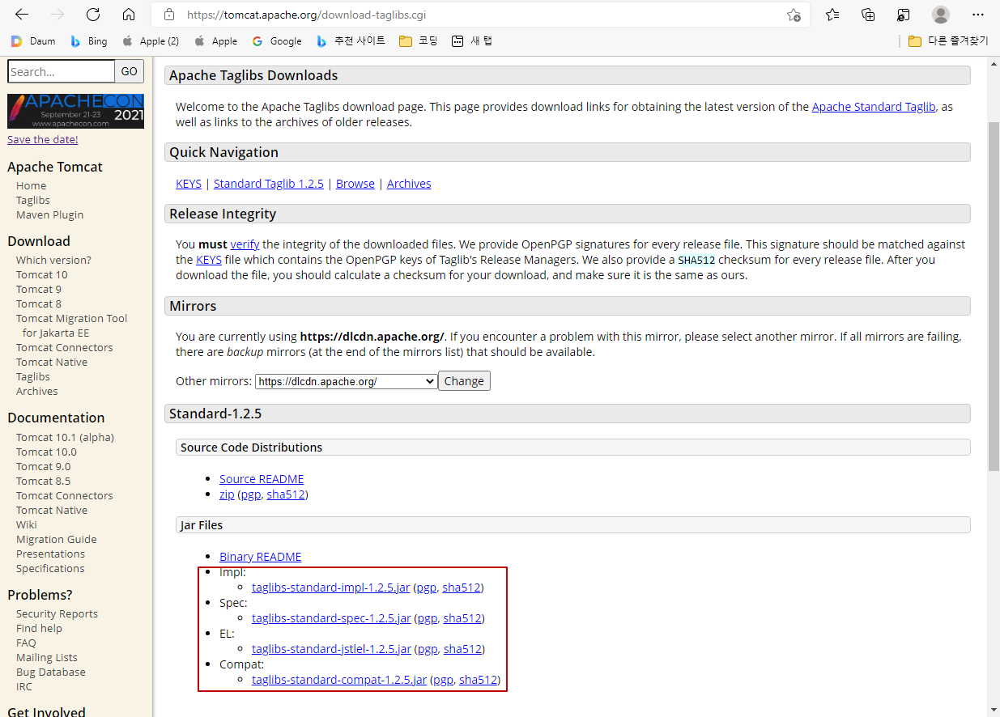

# JSTL ( JSP Standard Tag Library )
- 스크립트릿을 사용할 필요 없이 JSP를 단순화 하는 많은 태그를 제공한다.
- EL과 함께 사용한다.
- 코드의 복잡성을 줄일 수 있고, 유지보수를 쉽게 할 수 있다.

## JSTL 라이브러리 종류
|라이브러리|접두어|기능|
|----|-|----|
|core|c| 자바언어와 유사한 언어를 사용, 사용흐름, 실행흐름 제어|
|XML|x| xml문서 처리기능 지원|
|국제화|fmt| 숫자, 날짜, 시간 포맷기능, 각종 나라 언어 지원|
|데이터베이스|sql|데이터베이스 데이터 crud기능 지원
|함수|fn|문자열 처리 함수 지원|

## JSTL 라이브러리 설치
1. http://tomcat.apache.org/ 방문
2. 왼쪽 download 항목의 Taglibs 클릭<br>

3. jar 파일 링크 다운로드<br>

4. 이클립스 WEB_INF 하위폴더 lib에 jar파일 복사

## JSTL 사용예시
- JSTL을 사용하려면 디렉티브 아래에 taglib를 한줄 추가해준다.
```jsp
<%@ page language="java" contentType="text/html; charset=UTF-8" pageEncoding="UTF-8" %>
<%@ taglib prefix="c" uri="http://java.sun.com/jsp/jstl/core" %>
```

### setAttribute
```jsp
<c:set var="num" value="100" scope="request" />
```
-request.setAttribute("num", "100"); 과 동일

### if문
```jsp
<c:if test="${num1 < num2 }">
  num2가 더 큰 수
</c:if>
<c:if test="${num1 > num2 }">
  num1이 더 큰 수
</c:if>
```

### for문
```jsp
  <%  
    for(int i = 1; i <=10; i++){
      out.println(i);
    }
  %>
  
  <c:forEach begin="1" end="10" var="i" step="1">
    ${i }
  </c:forEach>
```
- 스크립트릿의 for문과 아래 forEach는 동일한 결과값을 얻는다.

### redirect
```jsp
  <c:redirect url="jstl01.jsp" />
```

### DB에 저장되어있는값 불러오기
```jsp
  <%
    DeptDAO dao = new DeptDAO();
    ArrayList<DeptVO> list = dao.selectAll();
    
    session.setAttribute("list", list);
  %>
  
  <c:forEach var="vo" items="${list }" >
    <h1>${vo.deptno}</h1>
    <h1>${vo.dname}</h1>
    <h1>${vo.loc}</h1>
  </c:forEach>
```

### switch문
```jsp
  <c:set var="score" value="90" scope="session" />
  
  <c:choose>
    <c:when test="${socre >= 90}">
      <p>${score}은 A학점</p>
    </c:when>
    <c:when test="${score >= 80 }">
			<p>${score }은 B학점.</p>
		</c:when>
		<c:when test="${score >= 70 }">
			<p>${score }은 C학점</p>
		</c:when>
		<c:when test="${score >= 60 }">
			<p>${score }은 D학점</p>
		</c:when>
		<c:otherwise>
			<p>${score }은 F학점</p>
		</c:otherwise>
	</c:choose>
  
```
