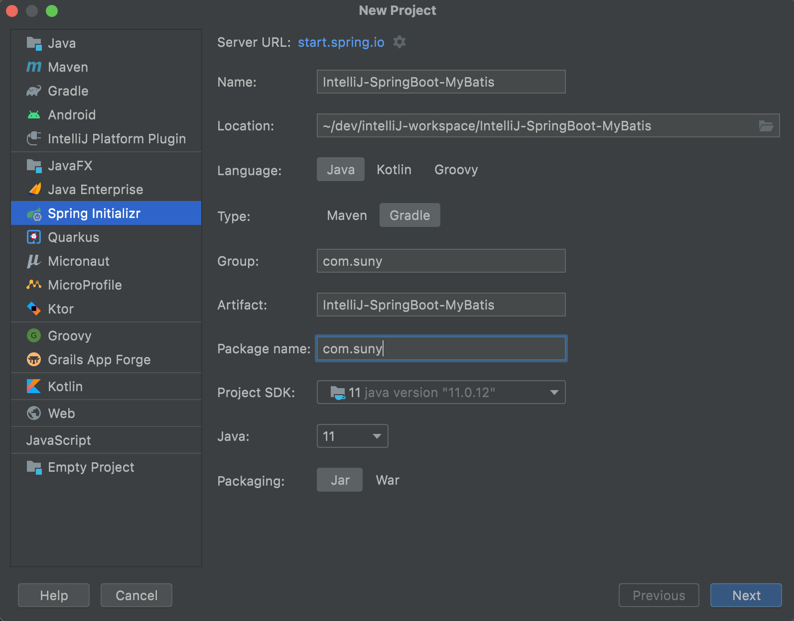
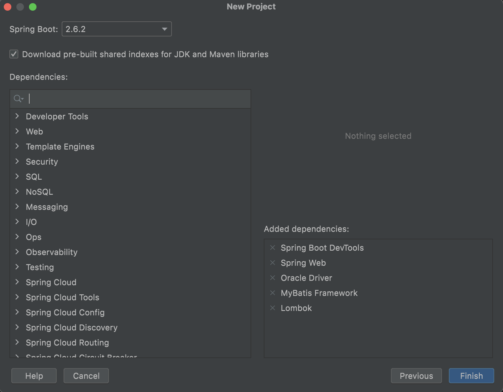
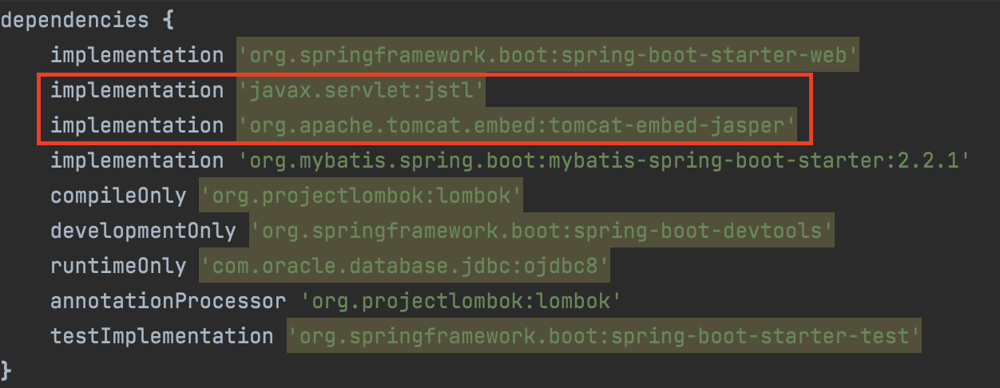
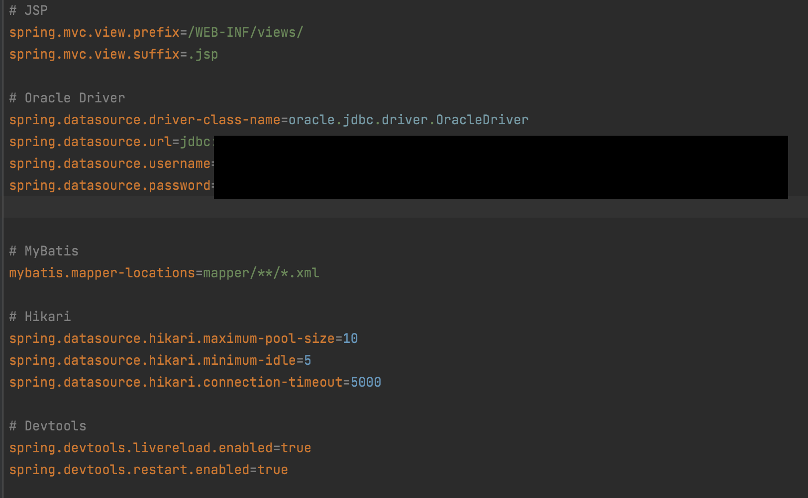
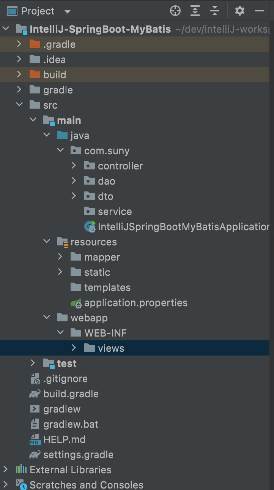

# IntelliJ IDEA 에서 SpringBoot와 MyBatis Setting 정리

## 1. Spring Initializr 클릭 후 gradle로 빌드 선택

## 2. 데이터베이스 연결을 위한 기본적인 의존성 추가

- 자바 코드 수정 후 자동 reload를 위한 DevTools 추가

## 3. build.gradle에 jsp파일을 읽기 위한 의존성 추가

- spring-boot-starter-web에 포함된 내장 톰캣에서는 JSP 엔진을 포함하고 있지 않다.
- jasper, jstl 라이브러리 추가

## 4. application.properties에 설정정보 작성

- JSP 파일을 읽어들일 경로 접두사, 접미사 설정
- Oracle Driver 설정정보 입력
- Mybatis mapper파일 경로 지정
- Hikari는 Database의 Connection Pool을 관리해준다.
- DevTools가 수정내용을 자동으로 reload할 수 있도록 관련정보 설정
  - 추가적으로 Preferences - Advanced Settings - 상단의 Allow auto-make .... 클릭
  - Preferences - Build - Compiler - Build project automatically 클릭

## 5. 프로젝트 폴더 구조

- main 하위에 webapp/WEB-INF/views 폴더 생성
- resources 하위에 mapper 폴더 생성

## ETC
- 모든 설정을 마치고 build 까지 완료했는데 jsp 파일 경로를 못 읽는 문제가 발생하면 IntelliJ를 재부팅하면 해결됨.

