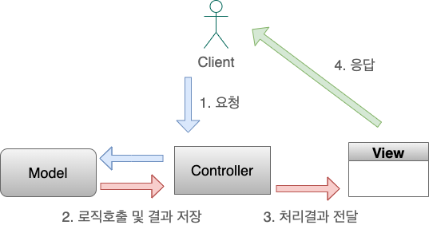

# MVC 패턴
- 디자인 패턴으로 비즈니스 처리 로직과 UI를 분리하여 서로 영향없이 개발하는 방법

## Model
- 뷰와 컨트롤러 사이에서 데이터를 주고받을 수 있게 해주는 객체, 내부 비즈니스 로직 처리
## View
- 모델과 컨트롤러가 보여줄려고 하는 것들을 화면에 출력
## Controller
- 화면에서 사용자의 요청을 받아 처리되는 부분 구현, 요청 내용을 분석해 Model과 View에 업데이트 요청을 함

